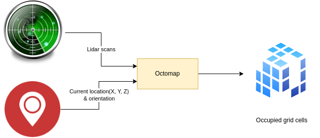

Implements occupancy 3D grid mapping by computing occupied "cells" from
[rplidar](https://github.com/tiiuae/rplidar_ros2#readme) 2D scans being applied to drone's current
(X, Y, Z) & orientation.



Port of the ROS1 [octomap server](https://github.com/OctoMap/octomap_mapping) for ROS2.0 


Development, debug
------------------

[See documentation in container base image](https://github.com/tiiuae/fog-ros-baseimage/tree/main#development--debug-for-concrete-projects)


Outdated documentation
----------------------

**WARNING**: Rest of the docs are outdated regarding container-specific build/running.


#### Installation
1.  Firstly make sure you have [octomap](https://github.com/OctoMap/octomap.git) installed on your system 
  ```bash
  sudo apt-get install ros-galactic-octomap ros-galactic-octomap-msgs
  ```

2.  Next, clone this ros package to the appropriate ros2 workspace
  ```bash
  git clone https://github.com/fly4future/octomap_server2.git
  ```

#### Building
Use colcon to build the workspace
```bash
colcon build --symlink-install --packages-select octomap_server2
```

### Notes:
- The package is compiled using `c++17` with `-O3` optimization.
